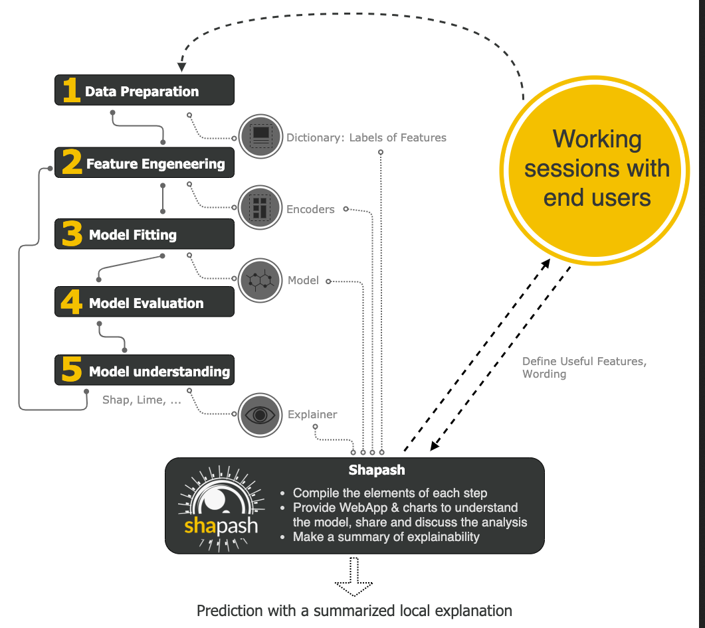

# Comment ça s'applique ?

# Comment sélectionner la population à évaluer
- Les individus avec des erreurs de prédictions
A la frontière ou loin de la frontière

Exemple avec Shapash

- Des individus exemples
Propos sur le clustering

- En filtrant par variables 
Présentes ou non dans le modèle